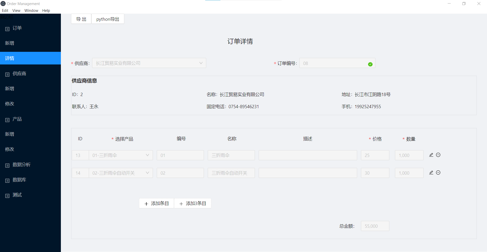

# 订单管理桌面应用
使用electron+web技术开发，由javascript+Python+sql编写的集成本地图形界面和后端数据库，具有excel/pdf输出功能的订单管理桌面应用

## 项目概述
1. 前端技术路线 React前端框架+antd组件+Redux状态管理。
2. sqlite订单存储，多数数据库查询直接由sql语句完成。使用orm库的部分功能（javascript种使用`sequelize`,python中使用`sqlalchemy`）会在后续升级中逐渐去除。
3. 订单excel导出
   
    方法1. javascript使用excelJs完成，

    方法2. 通过grpc架设python服务，python中使用openpyxl或者pywin32导出.
4. 供应商pdf报告输出，`ant design charts`绘图，调用electron主进程API`printToPdf`导出pdf。


## 代码架构
* `src` javascript以及前端界面相关代码
* `dist` 前端代码编译目录，React框架js文件以及css文件编译后存放目录
* `pythonServer` python服务进程相关代码，grpc进程间通信接口代码有grpc-tools 根据brotobuf自动生成
* `db` 数据库sqlite文件目录
* `public` 公用代码 比如electron主进程代码，excel/pdf导出模板文件，grpc protobuf文件
* `output` 应用生成的excel/pdf文件保存目录
* `__tests__` jest测试目录
* `pytest` pytest测试目录

## 安装
  
1. 克隆代码至本地目录
    ```sh
    git clone git@gitee.com:kevinwang89/electron-order-management.git
    ```
2. 设置python服务运行环境
   
   1. 使用conda创建python3.9虚拟环境
       ```sh
       conda create -n electron python=3.9
       ```
   2. 激活python环境并安装依赖库 依赖库文件在源代码python文件夹内
       ```sh
       conda activate electron
       conda install -f python/requirement_conda.txt
       pip install  -r python/requirement_pip.txt
       ```

## 编译运行
1. 进入源代码根目录安装node依赖
    ```sh
    npm install
    ```
2. 编译前端代码
    ```sh
    npm run build
    ```
3. 运行
    ```sh
    npm start
    ```
    `npm start`命令会先激活conda环境，如果选择其他python安装方式请做出相应修改
## 界面展示
* 订单详情
    
* 订单excel导出
    
* 供应商分析
    
* 供应商分析PDF报告
    


