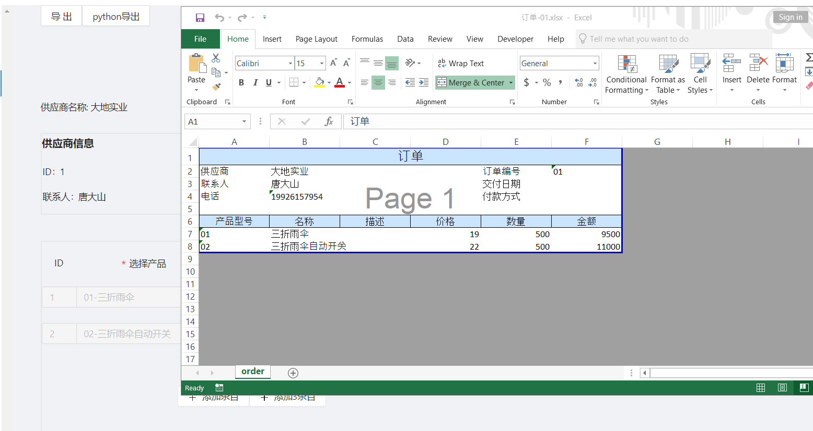

# 订单管理桌面应用
使用electron开发，由javascript+Python+sql编写的集成本地图形界面和后端数据库，具有excel/pdf输出功能的订单管理桌面应用

## 项目概述
1. 前端技术路线 React前端框架+antd组件+Redux状态管理。
2. 数据存储使用sqlite
3. grpc架设python服务与electron 渲染进程通信
4. 订单excel导出
   - javascript使用excelJs完成，
   - python服务中使用openpyxl或者pywin32导出.
5. 供应商pdf报告输出，`ant design charts`绘图，html设置打印属性，调用electron主进程API`printToPdf`导出pdf。


## 代码架构
* `src` 代码存储目录
  
  * `main` electron 主进程代码
  * `renderer` electron渲染进程代码
  * `bridges` electron 进程间通讯 api 代码
  * `pythonServer` python服务进程相关代码
* `buildConfig` webpack 配置代码
* `public` 公用代码 比如 grpc protobuf文件
* `assets` 系统图标等
* `release` 打包文件存储路径
    * app/dist webpack 打包文件路径
    * build exe封装文件存储路径

## 可执行文件安装
win10 x64 可直接从relase界面下载。 能力有限只有windows X64 版本。

## 源代码安装
  
1. 克隆代码至本地目录
    ```sh
    git clone git@gitee.com:kevinwang89/electron-order-management.git
    ```
2. python服务运行环境 本人使用conda,以下为conda配置命令 
    ```sh
    conda create -n electron python=3.9
    conda activate electron
    conda install -f python/requirement_conda.txt
    pip install  -r python/requirement_pip.txt
    ```

## 源代码编译运行
1. 进入源代码根目录安装node依赖
    ```sh
    npm install
    ```
2. 以开发环境运行
    ```sh
    npm start
    ```
    `npm start`命令会先激活conda环境，如果选择其他python安装方式请做出相应修改

3. 生成安装文件
    ```sh
    npm run package
    ```

## 界面展示
* 订单详情
    
* 订单excel导出
    
* 供应商分析
    
* 供应商分析PDF报告
    


